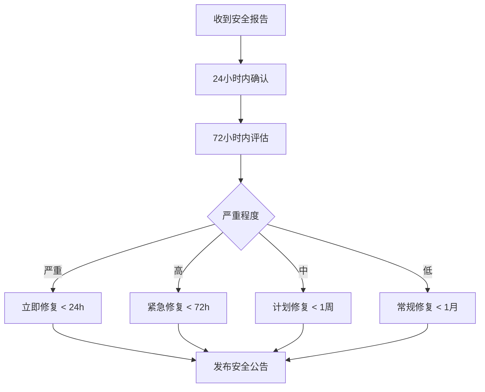

# 安全策略

## 📋 目录

- [支持的版本](#支持的版本)
- [安全漏洞报告](#安全漏洞报告)
- [安全最佳实践](#安全最佳实践)
- [依赖安全管理](#依赖安全管理)
- [响应流程](#响应流程)
- [安全更新通知](#安全更新通知)

## 🔒 支持的版本

我们积极维护以下版本的安全更新：

| 版本             | 支持状态     | 安全更新   | 维护期限 |
|----------------|----------|--------|------|
| 0.0.1-SNAPSHOT | ✅ 当前开发版本 | ✅ 立即修复 | 持续   |
| 0.0.1          | 🔄 计划发布  | ✅ 立即修复 | 12个月 |

### 版本支持说明

- **当前开发版本**：我们会立即修复所有已知的安全漏洞
- **稳定版本**：安全漏洞将在48小时内发布补丁版本
- **历史版本**：建议升级到最新支持版本

## 🚨 安全漏洞报告

### 报告渠道

如果您发现了安全漏洞，请**不要**在公共 Issue 中报告。请通过以下私密渠道联系我们：

#### 首选方式

- **安全邮箱**: security@glseven.com
- **加密邮件**: 使用我们的 [PGP 公钥](https://keybase.io/glseven) 加密敏感信息

#### 备用方式

- **GitHub 私信**: 直接私信项目维护者
- **安全报告**: 使用 GitHub Security Advisories

### 报告内容

请在报告中包含以下信息：

```markdown
## 漏洞概述

简要描述安全漏洞的性质和影响

## 影响范围

- 受影响的模块：[如 athena-starter-web]
- 受影响的版本：[如 0.0.1-SNAPSHOT]
- 漏洞类型：[如 SQL注入、XSS、权限绕过等]
- 严重程度：[严重/高/中/低]

## 重现步骤

1. 详细的重现步骤
2. 必要的环境配置
3. 测试用例或概念验证代码

## 影响评估

- 潜在的安全风险
- 可能的攻击场景
- 业务影响评估

## 建议修复方案

如果您有修复建议，请提供详细说明
```

### 响应承诺

- **确认回复**: 24小时内确认收到报告
- **初步评估**: 72小时内完成初步安全评估
- **修复时间**: 根据严重程度确定修复时间表

## 🛡️ 安全最佳实践

### 开发安全规范

#### 1. 身份认证和授权

```java
// ✅ 正确的密码处理
@Service
public class UserService {

    private final PasswordEncoder passwordEncoder;

    public boolean authenticate(String username, String rawPassword) {
        User user = userRepository.findByUsername(username);
        return passwordEncoder.matches(rawPassword, user.getEncodedPassword());
    }
}

// ❌ 错误的密码处理
public boolean authenticate(String username, String password) {
    User user = userRepository.findByUsername(username);
    return password.equals(user.getPassword()); // 明文比较
}
```

#### 2. 输入验证和数据清理

```java
// ✅ 使用参数化查询
@Repository
public class UserRepository {

    @Query("SELECT u FROM User u WHERE u.username = :username")
    User findByUsername(@Param("username") String username);
}

// ❌ 字符串拼接SQL
public User findByUsername(String username) {
    String sql = "SELECT * FROM users WHERE username = '" + username + "'";
    // 存在SQL注入风险
}
```

#### 3. 敏感信息处理

```java
// ✅ 正确的日志记录
@Slf4j
@Service
public class PaymentService {

    public void processPayment(PaymentRequest request) {
        log.info("Processing payment for user: {}", request.getUserId());
        // 不记录敏感信息如卡号、密码等
    }
}

// ❌ 错误的日志记录
public void processPayment(PaymentRequest request) {
    log.info("Processing payment: {}", request); // 可能泄露敏感信息
}
```

### 配置安全

#### 1. 生产环境配置

```yaml
# application-prod.yml
spring:
  profiles:
    active: prod

# 关闭不必要的端点
management:
  endpoints:
    web:
      exposure:
        include: health,info
  endpoint:
    health:
      show-details: never

# 安全头配置
server:
  servlet:
    session:
      cookie:
        secure: true
        http-only: true
        same-site: strict
```

#### 2. 开发环境隔离

```yaml
# application-dev.yml
spring:
  profiles:
    active: dev

# 开发环境可以暴露更多端点，但不能用于生产
management:
  endpoints:
    web:
      exposure:
        include: "*"
```

## 📦 依赖安全管理

### 依赖扫描

我们使用以下工具定期扫描依赖漏洞：

#### 1. Maven 依赖检查

```xml
<!-- pom.xml -->
<plugin>
    <groupId>org.owasp</groupId>
    <artifactId>dependency-check-maven</artifactId>
    <version>8.4.0</version>
    <configuration>
        <failBuildOnCVSS>7.0</failBuildOnCVSS>
    </configuration>
</plugin>
```

#### 2. 定期更新策略

- **关键安全更新**: 立即更新
- **常规依赖更新**: 每月评估和更新
- **主要版本升级**: 每季度评估

### 已知安全依赖

以下依赖有特殊的安全考虑：

| 依赖              | 版本     | 安全说明                    |
|-----------------|--------|-------------------------|
| Spring Boot     | 3.5.0  | 定期关注 Spring Security 更新 |
| Spring Security | 6.4.x  | 使用最新版本，关注CVE公告          |
| Jackson         | 2.18.x | 注意反序列化漏洞                |
| Netty           | 4.1.x  | 关注网络协议相关漏洞              |

## 🔄 响应流程

### 漏洞处理流程



### 严重程度分级

| 级别     | 描述           | 响应时间   | 示例          |
|--------|--------------|--------|-------------|
| **严重** | 可导致系统完全控制    | < 24小时 | 远程代码执行、权限提升 |
| **高**  | 可导致数据泄露或服务中断 | < 72小时 | SQL注入、认证绕过  |
| **中**  | 可能影响部分功能     | < 1周   | XSS、信息泄露    |
| **低**  | 轻微安全影响       | < 1月   | 配置问题、弱加密    |

## 📢 安全更新通知

### 通知渠道

- **GitHub Releases**: 所有安全更新都会在发布说明中标明
- **安全公告**: 重要安全更新会发布专门的安全公告
- **邮件列表**: security-announce@glseven.com
- **RSS订阅**: 关注我们的安全更新RSS

### 更新建议

1. **订阅通知**: 建议所有用户订阅安全更新通知
2. **及时升级**: 收到安全更新后请及时升级
3. **测试验证**: 升级后请验证功能正常性
4. **备份数据**: 升级前请做好数据备份

## 🤝 安全合作

### 负责任的披露

我们遵循负责任的安全漏洞披露原则：

- 给予研究人员充分的时间报告漏洞
- 在修复完成前不公开漏洞详情
- 公开感谢负责任的安全研究人员

### 安全研究人员认可

我们将在以下情况下公开感谢安全研究人员：

- 报告了有效的安全漏洞
- 遵循了负责任的披露流程
- 协助验证和改进修复方案

### Bug Bounty 计划

我们正在考虑建立 Bug Bounty 计划，为发现重要安全漏洞的研究人员提供奖励。

## 📞 联系我们

如有任何安全相关问题，请通过以下方式联系我们：

- **安全团队邮箱**: security@glseven.com
- **项目维护者**: athena-dev@glseven.com
- **紧急联系**: emergency-security@glseven.com

---

**感谢您帮助保护 Athena 生态系统的安全！** 🔒
